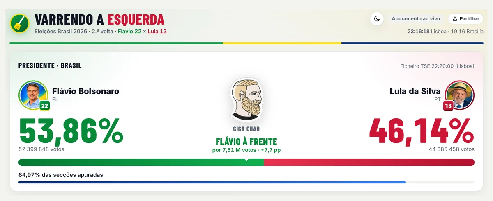
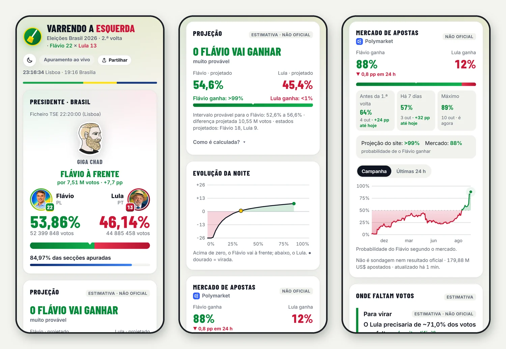
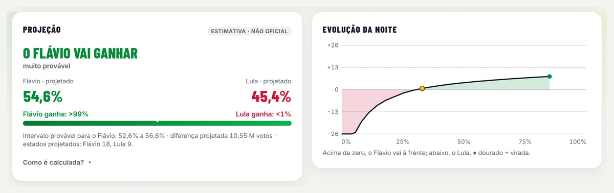
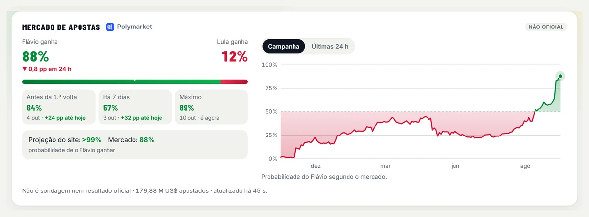
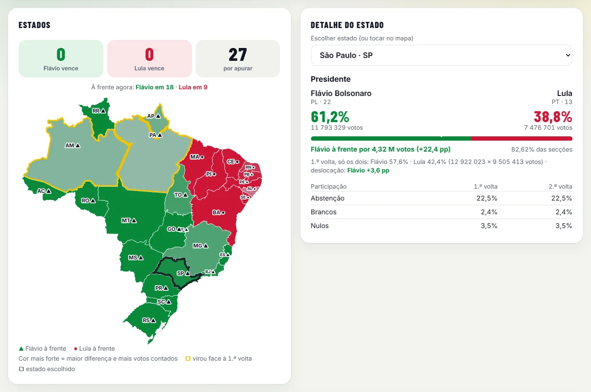
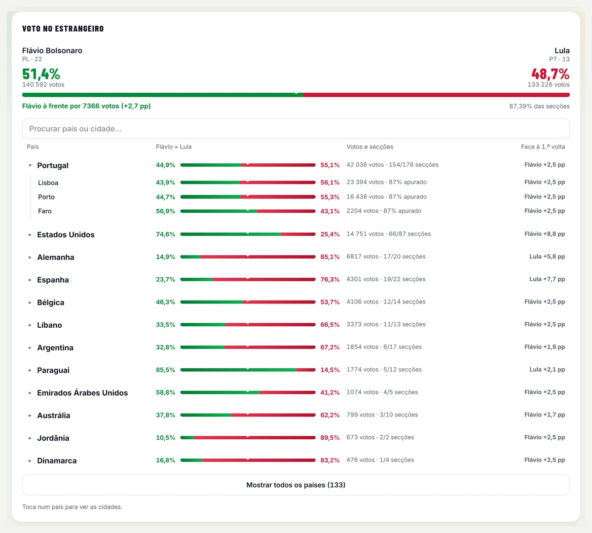
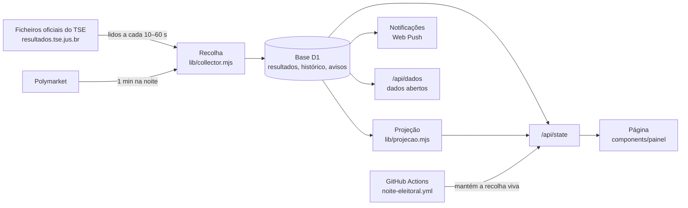

<div align="center">


# Varrendo a Esquerda

**A 2.ª volta das presidenciais do Brasil 2026, ao vivo: Flávio Bolsonaro (PL, 22) × Lula (PT, 13)**

Resultados oficiais do TSE em tempo real, projeção calibrada em noites reais, mercado de apostas,
mapa, estrangeiro com Portugal no topo e notificações no telemóvel, vistos por quem torce pelo Flávio.

[](https://github.com/tpereira2005/varrendo-a-esquerda/actions/workflows/testes.yml)
[](LICENSE)
[](dados-abertos/)
[](https://varrendo-a-esquerda.tomaspereira.chatgpt.site)

**[Abrir o site](https://varrendo-a-esquerda.tomaspereira.chatgpt.site)** · [Dados abertos](dados-abertos/) · [Como funciona a projeção](#projeção) · [Operação na noite](docs/operacao.md)



</div>

> As capturas usam a noite simulada do site (`npm run simulador`), não resultados reais.

## O que tem

| | |
|---|---|
| **Placar ao vivo** | Percentagens e votos oficiais, secções apuradas, fotos dos candidatos e o boneco do projeto original, que reage ao que falta para virar. |
| **Projeção** | Resultado final estimado, intervalo de 95% e probabilidade de vitória, por estado e no país. Testada em duas noites reais. Sempre "não oficial". |
| **Mercado de apostas** | Probabilidade do Polymarket, com o gráfico da campanha, das últimas 24 h e da noite eleitoral, comparada com a projeção. |
| **Para virar e onde faltam votos** | O que o candidato atrás precisaria e quanto vale cada estado ainda por apurar. |
| **Mapa e estados** | Quem vai à frente em cada estado, estados que viraram face à 1.ª volta, detalhe e participação de cada um. |
| **Abstenção** | Abstenção, brancos e nulos face à 1.ª volta e onde mais mudou. |
| **Voto no estrangeiro** | 133 países e 186 cidades com consulado, Portugal no topo. |
| **Avisos e notificações** | Viradas, marcos e estados decididos, com sons diferentes; notificações com o site fechado (também no iPhone, com o site no ecrã principal). |
| **Festejo** | Pré-festejo quando a projeção ou o Polymarket chegam a 99% e o festejo oficial, com o Hino Nacional, quando o TSE declara o Flávio eleito. |
| **Imagem para partilhar** | Cartão com o resultado, no tema claro ou escuro. |
| **Arquivo da 1.ª volta** | Resultados finais por estado e por país. |

## No ecrã

<div align="center">

<br /><sub>No telemóvel: placar, projeção e evolução da noite, mercado de apostas</sub>
</div>

<table>
<tr>
<td width="50%" valign="top"><br /><sub><b>Projeção</b> com intervalo e probabilidade, e a evolução da noite</sub></td>
<td width="50%" valign="top"><br /><sub><b>Mercado de apostas</b> (Polymarket), comparado com a projeção</sub></td>
</tr>
<tr>
<td width="50%" valign="top"><br /><sub><b>Mapa</b> e detalhe de cada estado, com a participação</sub></td>
<td width="50%" valign="top"><br /><sub><b>Estrangeiro</b> por país e cidade, com Portugal no topo</sub></td>
</tr>
</table>

<div align="center">

<br /><sub>O festejo, com o Hino Nacional, quando o TSE declara o Flávio eleito</sub>
</div>

## Regras

1. Todos os números vêm dos ficheiros oficiais do TSE, sem alterações.
2. Vitória só com indicação oficial do TSE; ir à frente não chega.
3. Estimativas (projeção, mercado de apostas) aparecem sempre como "não oficiais".
4. O agrupamento "direita/esquerda" é o critério do [projeto original](https://github.com/ODevLibertario/varrendo-a-esquerda), não do TSE.

## Projeção

A contagem bruta engana: nas duas noites testadas, os primeiros votos favoreceram o candidato da direita (cerca de 56% no início para 49–51% no fim). A projeção ([`lib/projecao.mjs`](lib/projecao.mjs)) corrige isso estado a estado:

1. **Ponto de partida**: a 1.ª volta em cada estado, com os votos dos eliminados redistribuídos.
2. **Deslocação** face a esse ponto, em três níveis (estado → região → país): um estado com pouco contado usa a da sua região.
3. **Tendência da contagem**: com o histórico da noite, mede como a quota muda à medida que se conta (a partir de 20% apurado em cada estado).
4. **Votos por apurar**, corrigidos pela afluência observada.
5. **Incerteza** com uma parte comum ao país e às regiões, afinada em noites simuladas e com margem de segurança.

**Testada em noites reais** ([`scripts/backtest.mjs`](scripts/backtest.mjs)), vendo em cada momento só o que se sabia nessa altura:

| Noite | Contagem bruta no início | Erro da projeção a partir de 50% apurado | Resultado no intervalo de 95% |
|---|---|---|---|
| 2.ª volta de 2022 | Bolsonaro até 56,5% (final 49,1%) | < 0,4 pp | sempre |
| 1.ª volta de 2026 (só os dois) | Flávio até 55,9% (final 51,0%) | ≤ 0,5 pp | sempre |

Em 2022 a projeção deu sempre o Lula como favorito, embora a contagem bruta mostrasse o Bolsonaro à frente até perto de 70% apurado.

## Dados abertos

[`dados-abertos/`](dados-abertos/) tem a **evolução da contagem versão a versão, estado a estado**, em CSV simples e no domínio público (CC0): 2.ª volta de 2022, 1.ª volta de 2026 e, depois de 25/10, a 2.ª volta de 2026. Também se descarregam diretamente do site em `/api/dados`.

## Como funciona



- **Recolha**: só lê o TSE quando há pedidos (visitas ou o workflow da noite), com uma concessão que impede leituras sobrepostas, cabeçalhos condicionais e pausa automática se o TSE pedir (403/429).
- **Alojamento**: Cloudflare Workers + D1, através do plugin Sites da OpenAI; página em React com vinext (Next.js sobre Vite).
- **Sem dependências no browser** para gráficos, mapa, sons ou imagem de partilha: SVG, canvas e Web Audio.

## Estrutura

| Pasta | Conteúdo |
|---|---|
| `app/` | Página (renderizada no servidor) e API: `/api/state`, `/api/collect`, `/api/arquivo`, `/api/dados`, `/api/push` |
| `components/painel/` | Placar, projeção, mercado, mapa, estrangeiro, abstenção, definições, festejo, sons, imagem de partilha |
| `lib/` | Ficheiros do TSE, disputas, recolha, base de dados, projeção, mercado, notificações |
| `data/` | 1.ª volta (gerada de `data/fontes/`) e histórico de noites reais (`data/historico/`) |
| `dados-abertos/` | Evolução da contagem em CSV (CC0) |
| `db/`, `drizzle/` | Esquema e migrações da base D1 |
| `scripts/` | Simulador do TSE, avaliação da projeção, dados abertos, chaves das notificações |
| `test/` | Testes automáticos, incluindo as noites reais |
| `docs/` | [Operação e noite da eleição](docs/operacao.md), [plano](docs/plano-segunda-volta.md), [base técnica](docs/base-tecnica-sites.md) |
| `build/`, `.openai/` | Integração com o alojamento Sites (não alterar) |

## Desenvolvimento

Requer Node.js 22.13 ou mais recente.

```bash
npm install
npm run dev               # site local em http://localhost:5173
npm run simulador         # TSE simulado para ensaiar a noite (ver docs/operacao.md)
npm test                  # testes, incluindo as noites reais de 2022 e 2026
npm run lint
npm run build
```

| Comando | Para quê |
|---|---|
| `npm run projecao:real` | Projeção nas noites reais de 2022 e 2026, momento a momento |
| `npm run projecao:simular` | Calibração em 500 noites simuladas |
| `npm run dados:descarregar -- 2` | Descarrega do site a noite da 2.ª volta e gera os dados abertos |
| `npm run dados:1a-volta` | Regenera o arquivo da 1.ª volta a partir de `data/fontes` |
| `npm run chaves:vapid` | Gera chaves para as notificações (a privada fica só no alojamento) |

A publicação é feita pelo plugin Sites da OpenAI (Codex); ver [docs/operacao.md](docs/operacao.md). Sugestões e erros: [abrir um issue](https://github.com/tpereira2005/varrendo-a-esquerda/issues/new/choose); ver também [CONTRIBUTING.md](CONTRIBUTING.md).

## Fontes e créditos

- Resultados: [divulgação de resultados do TSE](https://www.tse.jus.br/eleicoes/informacoes-tecnicas-sobre-a-divulgacao-de-resultados) ([formato do ficheiro unificado](https://www.tse.jus.br/eleicoes/eleicoes-2026-content/arquivos/divulgacao-de-resultados/tse-ea20-arquivo-de-resultado-unificado)).
- Inspirado em [ODevLibertario/varrendo-a-esquerda](https://github.com/ODevLibertario/varrendo-a-esquerda), de onde vêm o mapa, o boneco e o agrupamento dos partidos.
- Evolução da contagem de 2022: gravações de Wesley Cota ([wcota/br_eleicoes_2022_2T](https://github.com/wcota/br_eleicoes_2022_2T)).
- Mercado de apostas: [Polymarket](https://polymarket.com) (dados públicos).
- Hino Nacional Brasileiro (instrumental, no festejo): United States Navy Band, domínio público ([Wikimedia Commons](https://commons.wikimedia.org/wiki/File:Hino_Nacional_Brasileiro_instrumental.ogg)). Os restantes sons são sintetizados no browser.
- Fotos dos candidatos: ilustrações fornecidas pelo autor do site.

## Licença

Código sob a [licença MIT](LICENSE); dados abertos em [CC0](dados-abertos/README.md#licença). Exceções, que pertencem aos respetivos autores:

- `lib/parties.json`, `lib/brazil-map.json` e as imagens do boneco (`public/emoji/`), do [projeto original](https://github.com/ODevLibertario/varrendo-a-esquerda);
- os ficheiros oficiais em `data/fontes/` e os dados derivados deles, publicados pelo TSE;
- `build/sites-vite-plugin.ts`, com a sua própria licença (`build/sites-vite-plugin.LICENSE`).

---

<sub>**English**: live dashboard for Brazil's 2026 presidential runoff (Flávio Bolsonaro × Lula) built on the official TSE result files, with a state-by-state projection backtested on real election nights, Polymarket odds, push notifications and open data (CC0) of the vote-count evolution. Interface in European Portuguese.</sub>
